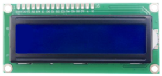
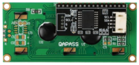
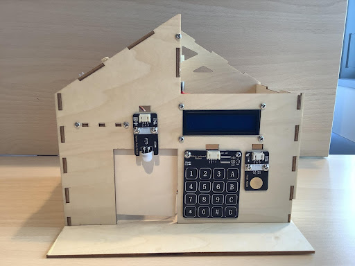
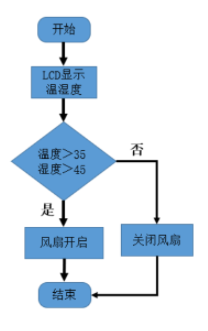
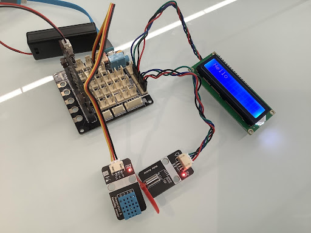
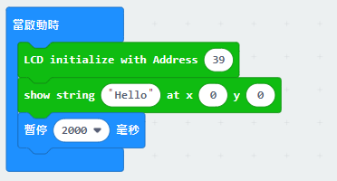
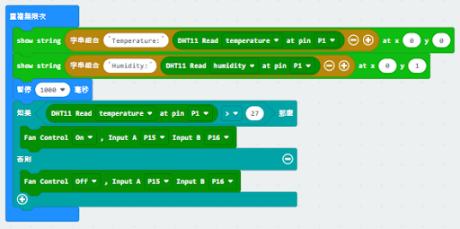

# 第八課 空氣質量檢測系統 

## 任務背景： 

隨著生活水平的不斷提高, 人們對健康的重視程度和要求越來越高.每當新居裝修完畢，家具及裝修材料中散發出的有毒氣體對老人和孩子會帶來很嚴重的傷害,也因此智能家居空氣質量檢測系統被越來越多的家庭所關注和採用。本節課的任務就是完成一個空氣質量的檢測系統。 

## 器材準備： 

microbit主板、擴展板、電池盒、2 節 AAA 電池、直流電動機風扇模塊、溫濕度傳感器、連接線、USB 數據線。 

## 一、了解空氣質量檢測系統 

空氣質量檢測系統是利用傳感技術，Zigbee 技術等短距離無線通信技術，和語音合成技術（TTS 技術）和空氣質量智能分析軟件來實現對室內的空氣質 量進行檢測，分析和報警提示，並智能開啟空氣凈化器，給家人一個健康的空氣環境。 

它的原理是通過室內安裝的不同的空氣質量傳感模塊，檢測到空氣質量情況，利用 Zigbee 模塊或者藍牙模塊傳輸到計算機，計算機上裝有空氣質量分析軟件，可以自動分析出我們身邊的質量如何，採取何種措施提高空氣質量等，這些信息可以通過語音播報器播報出來，提示主人需採取空氣凈化措施，並智能開啟空氣凈化器。 

而本課程製作的空氣質量檢測是利用溫濕度傳感器、LCD 顯示器組成，實現 LCD 顯示器顯示智能家居的各項指標，如果室內空氣不符合標準，蜂鳴器就會發生警報提醒人們，風扇啟動凈化室內空氣。 

## 二、了解 LCD 顯示器 

本課程使用的顯示器是 LCD1602 顯示器，其是一種專門用於顯示字母，數字和符號的字符 LCD 模塊。 它廣泛應用於工業，比如電子鐘，溫度顯示器。 “1602”表示每行 2 行和 16 個字符。帶了轉接板的 LCD1602 顯示屏, 使用了 IIC 通信, 節省了許多的 I/O 口. 1602 液晶顯示器（1602Liquid Crystal Display，此後簡稱 1602 LCD）是一種常見的字符液晶顯示器，因其能顯示 16*2 個字符而得名。通常我們使用的 1602 LCD 中集成了字庫芯片，通過 LiquidCrystal 類庫提供的 API，我們可以很方便的使用 1602LCD 顯示英文字母與一些符號。 

  
 

  
 

在該模塊中我們使用 IIC LCD1602 模塊集成了 IIC I/O 擴展芯片 PCF8574，使 LCD 1602 的使用更為簡單。通過兩線制的 IIC 總線（串行時鐘線 SCL，串行數據線 SDA），可通過 Arduino IIC 實現控制 LCD 1602 顯示的目的。既簡化了電路，又節省了 I/O 口，使 Arduino 能實現更多的功能。通過設置跳線還可以設置地址: 0x20-0x27。使 Arduino 能控制多塊 LCD 1602。 

LCD1602 顯示器背後的接線引腳分別為 GND，VCC，SDA，SCL（SDA 和 SCL 分別是 IIC 通訊的數據線和時鐘線）。 

## 三、空氣檢測系統安裝 

溫濕度傳感器在課程前面內容中已經安裝好，本節課中只需要安裝 LCD 顯示即可。用 M3*12 螺絲把 LCD 顯示器安裝房子前面，如圖所示。 

  
 

## 四、程序設計 

### 4.1 算法設計：  

首先用溫濕度傳感器讀取周圍的溫濕度數字，然後在LCD 顯示器顯示出來，且判斷溫濕度數值如果大於設定的閾值，則啟動風扇；否則，關閉風扇。其程序流程如下： 

第一步：顯示器顯示溫濕度變化 

第二步：判斷溫度或濕度是否大於閾值，如果是，則打開風扇；否則關閉風扇； 

第三步：結束算法  

  
 

### 4.2 硬件連接： 

LCD 顯示器連接在擴展板的 P19、P20管腳；溫濕度傳感器連接在擴展板的 P1 管腳；直流電機風扇模塊連接在擴展板的 P15、P16管腳。 

傳感器和執行器|主控板 
:--|:--
LCD 顯示器|P19（SCL）、P20（SDA） 
溫濕度傳感器|P1 
直流電機風扇模塊|P15、P16 

  
 

### 4.3 程序示例： 

Makecode 程序 

  
 

  
 

https://makecode.microbit.org/_b88MobFdC3ik 

## 五、總結 

本節課我們學習了空氣檢測系統的原理，利用溫濕度傳感器、LCD 顯示器、摩打風扇模塊製作一個隨時可以了解室內溫濕度的變化，並實現能自動凈化空氣的功能。在這過程中，也掌握了 LCD 顯示器的原理及編程控制使用。 

