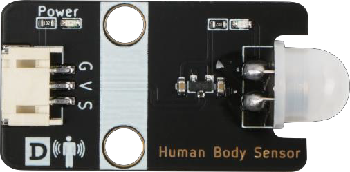

# 第二課  智能人體感應燈 
## 任務背景 

在普通家居中，照明燈都是採用手動開關來控制的，而手動開關的安裝一般距離地面有一定的高度。如果家裡有老人小孩，使用會非常不方便。如果照明燈變成自動感應控制的，是不是會更加智能與便捷？這就是我們這節課的任務——製作一個智能人體感應燈。 

 
    
## 器材準備 

Micro:bit主板、擴展板、電池盒和 2 節 AAA 電池、人體感應傳感器模塊、白色LED燈模塊、連接線、USB 數據線。 

    
## 一、了解智能人體感應燈 

人體感應燈是一款利用紅外線、熱釋電原理感應人體活動信息的新技術設計、研發而成的，專門用來檢測和感應人體活動信息的產品。當人或有溫度的物體進入模塊感應範圍內時，感應模塊就會輸出一個高電平脈衝信號、或高電平延時信號，輸出的感應脈衝或延時信號可以直接驅動 LED 燈指示燈、LED 照明燈。 

本課程製作的人體感應燈是利用人體傳感器模塊實現的，其原理是當人體感應傳感器模塊檢測有人靠近時，就打開照明燈；反之，當人離開時，燈自動關閉。

## 二、了解人體感應傳導器模塊和紅綠燈模塊 

### 2.1 人體感應傳感器模塊 

本課程使用的人體感應傳感器模塊是 HC-SR505 小型人體感應模塊，該模塊是基於紅外線技術的自動控制產品，靈敏度高，可靠性強，超小體積，超低電壓工作模式。廣泛應用於各類自動感應電器設備，尤其是乾電池電的自動控制產品。該模塊有以下兩點功能： 

    
 
全自動感應:人進入其感應範圍則輸出高電平，人離開感應範圍則自動延時關閉高電平，輸出低電平。 
 
可重覆觸發方式：即感應輸出高電平後，在延時時間段內，如果有人體在其感應範圍活動，其輸出將一直保持高電平，直到人離開後才延時將高電平變為低電平（感應模塊檢測到人體的每一次活動後會自動順延一個延時時間段，並且以最後一次活動的時間為延時時間的起始點HC-SR505 小型人體感應模塊有三個管腳，G 為 GND 接地，V 為 VCC 接高電平或 5v，S 為信號管腳，可以接 D1-D13 數字接口。

### 2.2 白色LED燈模塊 

白色LED燈模塊是由1 種顏色 LED 組成的模塊。該模塊有G,V,S 3個管腳，G為負極接地 GND，V為正極接高電平 VCC 或 5v，S 為信號管腳。 

    
.jpg) 

## 三、人體感應燈安裝 

    把 HC-SR505 小型人體感應模塊安裝在左側門上方，白色LED安裝右側門上；主板和擴展板結合，然後安裝在底板上。如圖所示： 

    
.jpg) 

    
## 四、程序設計 

### 4.1 算法設計 

    根據人體感應燈的原理，當人體感應傳感器感應到靠近時，自動開啟 LED 燈；過一段時間，LED 燈自動關閉；如果沒有人靠近時，LED 是關閉的。其算法流程設計如下： 

 

    
.png) 

    
### 4.2 硬件連接 

    HC-SR505 人體感應模塊連接在 Micro:bit板的 P1管腳，白色LED燈模塊連接在 Micro:bit 擴展板的P2管腳。 

傳感器和執行器             主控板 
HC-SR505 人體感應模塊      P1 
白光LED燈模塊              P2 

    
.jpg) 

### 4.3 程序示例 
Makecode編程

    
.png) 

https://makecode.microbit.org/_RkmbfDhPPHto 

    
## 五、總結 

    本節課學習了智能人體感應燈的原理，了解人體感應傳感器和LED模塊的特點及其使用，並編程實現人來燈亮，人走燈滅的功能。 

